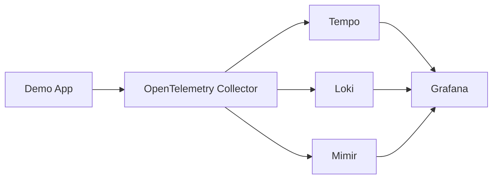

# Cloud-Native Observability Demo

This project demonstrates a complete cloud-native observability stack using OpenTelemetry, Grafana, and Kubernetes. It showcases best practices for monitoring, logging, and tracing in a microservices environment.

## 🎯 Features

- ✨ OpenTelemetry Demo Application with built-in instrumentation
- 📊 Complete Grafana observability stack (Loki, Prometheus, Tempo, Mimir)
- 🔄 Automatic metrics collection and visualization
- 🗄️ Persistent PostgreSQL database
- 🚀 Kubernetes-native deployment
- 📈 Pre-configured Grafana dashboards

## 🏗️ Architecture

### Components

1. **Demo Application**
   - OpenTelemetry Demo Shop application
   - Horizontally scalable (default: 2 replicas)
   - Automatically instruments metrics, traces, and logs

2. **Database Layer**
   - PostgreSQL 15.3
   - Persistent storage (10GB)
   - Stateful deployment

3. **Observability Stack**
   - Grafana (visualization)
   - Loki (logs)
   - Tempo (traces)
   - Mimir (metrics)
   - OpenTelemetry Collector (telemetry pipeline)

### Data Flow



## 🚀 Setup

### Prerequisites

- Kubernetes cluster (1.19+)
- `kubectl` configured to access your cluster
- LoadBalancer support in your cluster
- Storage class for persistent volumes

### Installation

1. **Clone the Repository**
   ```bash
   git clone <repository-url>
   cd <repository-name>
   ```

2. **Review Configuration (Optional)**
   - Database credentials in `k8s/secrets.yaml`
   - Grafana admin password in `k8s/grafana-credentials.yaml`
   - Storage requirements in `k8s/postgres.yaml`

3. **Deploy the Stack**
   ```bash
   ./deploy.sh
   ```

   The script will:
   - Create necessary namespaces
   - Deploy all components
   - Wait for deployments to be ready
   - Display access information

### Accessing the Services

1. **Demo Application**
   - URL: `http://<LOAD_BALANCER_IP>:8080`
   - The IP will be displayed after deployment

2. **Grafana Dashboard**
   - URL: `http://grafana.local`
   - Add to your hosts file:
     ```
     <LOAD_BALANCER_IP> grafana.local
     ```
   - Default credentials:
     - Username: `admin`
     - Password: `admin123`

## 📊 Monitoring Features

### Metrics
- Request rates
- Response times
- Error rates
- Database connections
- Resource usage

### Logs
- Application logs
- Database logs
- System logs
- Kubernetes events

### Traces
- End-to-end request tracing
- Service dependencies
- Performance bottlenecks
- Error analysis

## 🔧 Maintenance

### Scaling

Scale the demo application:
```bash
kubectl scale deployment otel-demo -n demo --replicas=3
```

### Updating

Update component versions:
1. Modify the relevant image tag in the corresponding YAML file
2. Apply the changes:
   ```bash
   kubectl apply -f k8s/<component>.yaml
   ```

### Backup

Database backup:
```bash
kubectl exec -n demo $(kubectl get pod -l app=postgres -n demo -o jsonpath='{.items[0].metadata.name}') -- \
  pg_dump -U otelshop otelshop > backup.sql
```

## 🔍 Troubleshooting

### Common Issues

1. **Pods Not Starting**
   ```bash
   kubectl get pods -n demo
   kubectl describe pod <pod-name> -n demo
   ```

2. **Database Connection Issues**
   ```bash
   kubectl logs -l app=otel-demo -n demo
   kubectl exec -it <postgres-pod> -n demo -- psql -U otelshop -d otelshop
   ```

3. **Grafana Access Problems**
   - Verify ingress configuration
   - Check hosts file entry
   - Ensure LoadBalancer IP is assigned

### Logs

View component logs:
```bash
# Demo App
kubectl logs -f -l app=otel-demo -n demo

# OpenTelemetry Collector
kubectl logs -f -l app=otel-collector -n demo

# Database
kubectl logs -f -l app=postgres -n demo
```

## 🔐 Security

### Credentials
- All sensitive data is stored in Kubernetes secrets
- Database credentials are automatically mounted
- Grafana admin password can be changed after first login

### Network
- Internal services use ClusterIP
- Only necessary ports are exposed
- TLS termination at ingress (when configured)

## 📈 Performance

### Recommendations
- Monitor resource usage
- Scale components based on metrics
- Adjust resource requests/limits as needed
- Use persistent storage for database

### Capacity Planning
- Default storage: 10GB for PostgreSQL
- Recommended node resources:
  - 4 CPU cores
  - 8GB RAM
  - 50GB storage

## 🤝 Contributing

1. Fork the repository
2. Create a feature branch
3. Commit your changes
4. Push to the branch
5. Create a Pull Request

## 📝 License

This project is licensed under the MIT License - see the LICENSE file for details.

## 🙏 Acknowledgments

- OpenTelemetry Demo Application team
- Grafana Labs for monitoring tools
- Kubernetes community 